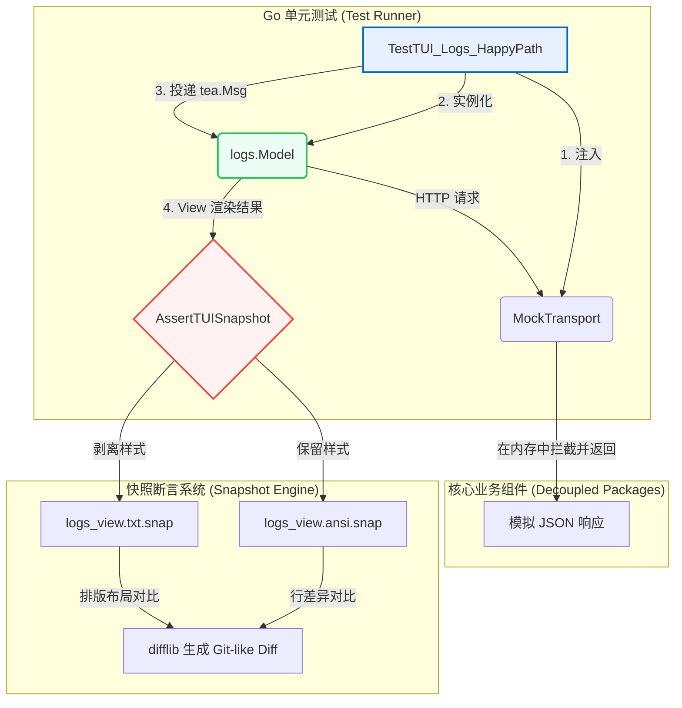

# feat/refactor: TUI 测试与快照框架及组件解耦实施计划

## 1. 问题定义与上下文

### 1.1 背景与痛点 (see origin: docs/brainstorms/2026-06-26-tui-testing-framework-requirements.md)
目前 LiteLLM CLI 项目的终端用户界面（TUI）均采用 Bubble Tea 框架编写，但目前处于**零测试覆盖**状态。核心交互逻辑集中于 `cmd/logs.go`（88KB，约1200+行）和 `cmd/stats.go`（628行）这两个 package-private 且高度耦合的文件中。由于缺乏测试保护，团队在手动修复 Bug（如时区解析、滚动越界、视图初始化）时极易引入回归 Bug。

根据最新的本地 codebase 研究，我们还发现了一个严重的**异步阻塞反模式（TUI 阻塞 Bug）**：`cmd/logs.go` 在处理 `tickMsg` 轮询时，同步调用了发起 HTTP 网络请求的 `m.refresh()`。**这意味着每 5 秒的定时数据刷新都会直接阻塞 Bubble Tea 的 UI 主线程**，在网络出现延迟时会导致界面卡顿、按键无响应。

### 1.2 目标与范围
本计划旨在构建一套轻量级、确定性高、在内存中运行极快的 TUI 测试基建，并对现有的 `logs` 和 `stats` 命令进行解耦重构，消除同步网络阻塞 Bug。

**范围边界**：
- **目标**：对解耦后的 `logs` 和 `stats` 的 `tea.Model` 状态机进行 100% 内存单元测试，并引入带色彩 (ANSI) 和纯文本 (TXT) 的双重 Golden File 快照对比测试。
- **非目标**：不引入 pty 伪终端、虚拟 terminal 仿真器等重量级集成测试；不测试 Cobra 命令行的辅助参数拼写细节。

---

## 2. 技术设计与架构方案

### 2.1 整体架构图
单元测试框架在 100% 内存中运行，通过 Mock Transport 拦截所有 Resty HTTP 请求，利用虚拟 Msg 序列驱动 Model 的状态演进，并最终通过双重快照断言视觉和排版的一致性：



### 2.2 核心技术决策与设计草案
*以下代码设计和正则模式为方向性引导设计，具体实现在执行阶段微调。*

#### 决策一：利用函数式选项 (Functional Options) 注入 Mock Transport
为了让底层 Resty 客户端支持内存拦截，在 `api.NewClient` 和 `client.New` 中引入可选的 `ClientOption`，避免在测试中启动真实 TCP 端口：

```go
// Directional Guidance: 接口与注入设计草案
package api

import "net/http"

type ClientOption func(*Client)

func WithTransport(transport http.RoundTripper) ClientOption {
    return func(c *Client) {
        c.resty.SetTransport(transport) // 注入底层的 Resty 传输层
    }
}
```

#### 决策二：双重快照对比与完备 ANSI 剥离正则
测试框架将在 `internal/testutils/tui.go` 中实现。为完美支持 CSI 颜色、样式以及 OSC（超链接）的剥离，我们设计了以下完备的剥离正则：

```go
// Directional Guidance: ANSI 剥离正则与快照断言草案
package testutils

import (
    "regexp"
    "testing"
)

// 包含常规 CSI (\x1b[...) 与 复杂的 OSC (\x1b]8;;...) 的完备正则
const AnsiPattern = `[\x1b\x9b]([()#;?]*(?:(?:(?:[a-zA-Z0-9]+(?:;[a-zA-Z0-9]+)*)?\x07)|(?:(?:[0-9]{1,4}(?:;[0-9]{0,4})*)?[0-9A-ORZcf-nqry=><])))|[\x1b\x9b]]8;;[^\x1b\x07]*(?:\x1b\\|\x07)`
var AnsiRegexp = regexp.MustCompile(AnsiPattern)

func StripANSI(s string) string {
    return AnsiRegexp.ReplaceAllString(s, "")
}

func AssertTUISnapshot(t *testing.T, snapshotName string, actualView string) {
    t.Helper()
    // 1. 保存/比对带色彩样式的原始快照：testdata/snapshots/<name>.ansi.snap
    // 2. 保存/比对剥离样式后的纯文本排版快照：testdata/snapshots/<name>.txt.snap
    // 3. 支持检测 UPDATE_SNAPSHOTS=true 环境变量进行自动更新录制
    // 4. 比对失败时利用 github.com/pmezard/go-difflib/difflib 输出 Git 风格 Diff
}
```

#### 决策三：消除 TUI 阻塞与异步化重构契约
将 `logsModel` 和 `statsModel` 从 `cmd/` 的全局变量及 Cobra 闭包中分离，打包到独立的 `internal/tui/logs/` 和 `internal/tui/stats/` 包中。
将 logs 的同步轮询改为 Bubble Tea 标准的异步 `tea.Cmd`：

```go
// Directional Guidance: 异步命令刷新与契约草案
package logs

import (
    "github.com/charmbracelet/bubbletea"
    "litellm-cli/internal/api"
)

type LogsClient interface {
    GetSpendLogsUI(start, end string) (*api.SpendLogsUIResponse, error)
    GetSpendLogDetail(id string) (map[string]interface{}, error)
}

type Model struct {
    client LogsClient
    // ...
}

type LogsLoadedMsg struct {
    Response *api.SpendLogsUIResponse
    Error    error
}

func (m *Model) RefreshCmd() tea.Cmd {
    return func() tea.Msg {
        resp, err := m.client.GetSpendLogsUI(m.start, m.end)
        return LogsLoadedMsg{Response: resp, Error: err}
	}
}
```

---

## 3. 实施步骤与分工 (Implementation Units)

```markdown
- [ ] 单元一：API/Client 层的 Mock Transport 与选项注入重构 <!-- id: U1 -->
- [ ] 单元二：实现测试基建 `testutils` 及双重快照断言库 <!-- id: U2 -->
- [ ] 单元三：`logs` 命令 TUI 模块的解耦与异步化重构 <!-- id: U3 -->
- [ ] 单元四：编写 `logs` TUI 的完整状态机与快照单元测试 <!-- id: U4 -->
- [ ] 单元五：`stats` 命令 TUI 模块的解耦、异步化与单元测试 <!-- id: U5 -->
```

---

### 单元一：API/Client 层的 Mock Transport 与选项注入重构
- **目标 (Goal)**：修改底层 `api.Client` 和外层 `client.Client`，支持函数式选项注入，以便在单元测试中重定向底层 Resty 请求至内存中的 `http.RoundTripper`。
- **依赖 (Dependencies)**：无
- **涉及文件 (Files)**：
  - `internal/api/types.go` (修改 `NewClient` 支持 `opts ...ClientOption`，并暴露 `WithTransport`)
  - `internal/client/client.go` (修改 `New` 以支持转发选项)
- **实现方案 (Approach)**：
  - 引入 `ClientOption` 函数签名。
  - 实现 `WithTransport(http.RoundTripper)`，在 `NewClient` 内部调用 `c.resty.SetTransport(transport)`。
- **测试场景 (Test Scenarios)**：
  - **单测文件**：`internal/client/client_test.go`
  - **测试用例**：
    - `TestClient_WithMockTransport`：构造一个自定义 `http.RoundTripper`，在内存中拦截请求并返回 Mock 响应。断言 `client.GetModels()` 能够无视网络环境直接成功解析返回的数据，确保 100% 内存拦截成功。

---

### 单元二：实现测试基建 `testutils` 及双重快照断言库
- **目标 (Goal)**：编写通用的测试辅助工具，包含完备的 ANSI 样式剥离、`.ansi.snap` & `.txt.snap` 双重快照管理以及高可读性的 Git 风格行级差异对比。
- **依赖 (Dependencies)**：无（可间接依赖项目已包含的 `go-difflib`）
- **涉及文件 (Files)**：
  - `internal/testutils/tui.go` (新建)
  - `internal/testutils/tui_test.go` (新建)
- **实现方案 (Approach)**：
  - 使用 ANSI 序列正则（或评估使用 `reflow/ansi`）实现 `StripANSI(string) string`。
  - 实现 `AssertTUISnapshot(t *testing.T, name string, actual string)`。读取 `testdata/snapshots/` 下的文件，若 `UPDATE_SNAPSHOTS=true` 则写入，否则进行比对。
  - 引入 `difflib.GetUnifiedDiffString` 输出失败时的色彩 diff 报告。
- **测试场景 (Test Scenarios)**：
  - **单测文件**：`internal/testutils/tui_test.go`
  - **测试用例**：
    - `TestStripANSI`：输入带有 Lipgloss 各种前景/背景色、加粗、下划线以及 OSC 链接的复杂终端文本，断言剥离后的字符串为纯净的无样式文本。
    - `TestAssertTUISnapshot`：测试快照对比的正确性。模拟在没有 `UPDATE_SNAPSHOTS` 时比对不匹配直接报错；在设置 `UPDATE_SNAPSHOTS=true` 时能够成功在本地 `testdata/snapshots/` 创建对应的 `.ansi.snap` 和 `.txt.snap` 快照文件。

---

### 单元三：`logs` 命令 TUI 模块的解耦与异步化重构
- **目标 (Goal)**：消除 `cmd/logs.go` 中 `logsModel` 的包私有耦合，将其移至独立包并重构同步网络请求，彻底消除定时刷新导致终端界面卡顿的阻塞 Bug。
- **依赖 (Dependencies)**：U1
- **涉及文件 (Files)**：
  - `internal/tui/logs/model.go` (新建，放置重构后的 `Model`、`NewModel` 以及 `LogsClient` 接口)
  - `cmd/logs.go` (修改 `runLogs`，导入并启动 `logs.NewModel`，清除原私有 `logsModel` 逻辑，**删除遗留的 `cmd/logs.go.bak` 冗余文件**)
- **实现方案 (Approach)**：
  - 定义 `LogsClient` 接口，解耦对外层 `*client.Client` 的硬编码依赖。
  - 将原本在 `tickMsg` 分支同步执行的 `m.refresh()` 改写为异步 `tea.Cmd`（返回 `LogsLoadedMsg`）。
  - 在 `Update` 中拦截 `LogsLoadedMsg` 并更新 Model 内部的列表状态。

---

### 单元四：编写 `logs` TUI 的完整状态机与快照单元测试
- **目标 (Goal)**：针对重构后的 logs TUI 状态机编写高度健壮的测试用例，覆盖各种正常交互与 API 异常边界。
- **依赖 (Dependencies)**：U2, U3
- **涉及文件 (Files)**：
  - `internal/tui/logs/model_test.go` (新建)
  - `internal/tui/logs/testdata/snapshots/` (快照归档目录)
- **实现方案 (Approach)**：
  - 用 MockTransport 构造内存 Mock 数据，实例化 `logs.NewModel`。
  - **强制色彩 Profile 锁定**：在测试 `init` 或测试用例开头，显式调用 `lipgloss.SetColorProfile(termenv.TrueColor)`（或锁定特定 Profile），防止在无 TTY 的 CI 环境中发生快照漂移。
- **测试场景 (Test Scenarios)**：
  - **1. Happy Path 交互与快照**：
    - `TestLogsTUI_HappyPath`：模拟模型初始化 -> 投递网络成功数据消息 -> 断言列表渲染 -> 投递键盘按键 `j` (向下滚动) -> 断言焦点行递增 -> 投递 `enter` -> 断言进入详情视图状态 -> 调用 `AssertTUISnapshot` 记录并核对列表页和详情页的 `.ansi` 和 `.txt` 快照。
  - **2. 401 Unauthorized 异常响应与降级**：
    - `TestLogsTUI_Unauthorized`：在 Mock 响应中返回 401 状态码，投递网络响应消息，断言 Model 能够展示友好的错误提示页面，且不发生 Panic。
  - **3. 403 Forbidden (非 Admin) 权限限制响应**：
    - `TestLogsTUI_Forbidden_v2`：模拟 `/spend/logs/v2` 接口返回 403。由于 logs TUI 具备自适应降级需求，断言 Model 能静默向底层的 `LogsClient` 发起 `/spend/logs` (v1 聚合日志) 的回退请求，并正常渲染聚合后的数据，保障普通凭证下的可用性。
  - **4. 500 Server Error 容错**：
    - `TestLogsTUI_InternalServerError`：模拟返回 500 状态码，断言 TUI 状态机能保持在稳定状态，并在界面顶部或错误视图中渲染出“服务器异常，请重试”的警示文案。

---

### 单元五：`stats` 命令 TUI 模块的解耦、异步化与单元测试
- **目标 (Goal)**：解耦并异步化重构 `cmd/stats.go`，建立单元测试，覆盖多聚合维度（user/team/model）的渲染及大屏和小屏下的响应式排版快照。
- **依赖 (Dependencies)**：U2, U3
- **涉及文件 (Files)**：
  - `internal/tui/stats/model.go` (新建，解耦后的 `Model`、工厂函数和 `StatsClient` 接口)
  - `cmd/stats.go` (修改 `runStats`，导入新包，移除本地私有状态机)
  - `internal/tui/stats/model_test.go` (新建)
  - `internal/tui/stats/testdata/snapshots/` (快照目录)
- **实现方案 (Approach)**：
  - 将 `statsModel` 的同步数据拉取重构为异步 `tea.Cmd`。
  - 支持在测试中模拟不同的终端尺寸检测（`tea.WindowSizeMsg`），以验证响应式布局。
- **测试场景 (Test Scenarios)**：
  - **1. 正常数据加载与柱状图渲染**：
    - `TestStatsTUI_RenderCharts`：Mock 传入包含用户/团队消费的指标数据，驱动状态机加载成功，调用 `AssertTUISnapshot` 验证柱状图 (Bar Chart) 和概览卡片的排版快照。
  - **2. 响应式布局测试（大屏 vs 小屏）**：
    - `TestStatsTUI_ResponsiveLayout`：
      - 场景 A (大屏)：向 Model 投递 `tea.WindowSizeMsg{Width: 140, Height: 40}`，调用 `View()` 并进行快照断言，确保概览卡片与柱状图呈**并排双栏布局**。
      - 场景 B (小屏)：向 Model 投递 `tea.WindowSizeMsg{Width: 80, Height: 24}`，进行快照断言，确保布局自动退化为**单栏垂直布局/Tab视图切换模式**，且排版无字符重叠或溢出。
  - **3. 空数据与零值容错**：
    - `TestStatsTUI_NoData`：模拟接口返回无数据的空数组，断言系统显示“暂无统计数据”的占位提示，且柱状图不发生除以零的 runtime panic。

---

## 4. 风险评估与缓解策略

| 风险 (Risk) | 严重度 (Severity) | 缓解策略 (Mitigation Strategy) |
|---|---|---|
| **CI 容器环境色彩检测漂移** (CI 环境无 TTY 导致生成的 ANSI 逃逸字符与本地不同，快照频繁报错) | 高 (High) | **强制锁定色彩Profile**：在所有单元测试的初始化或 `TestMain` 中，强制调用 `lipgloss.SetColorProfile(termenv.TrueColor)`。这能锁死渲染输出，屏蔽运行平台环境的自动嗅探，确保 CI 表现与本地 100% 一致。 |
| **异步命令（Cmd）模拟的脆弱性** (测试代码过度依赖 `Update` 返回的内部 Cmd 链条，导致重构极易中断测试) | 中 (Medium) | **基于最终状态与 View 断言**：在测试用例编写指南中，明确不建议断言每一个 `Cmd` 的函数指针，而是直接通过调用 `Update` 投递最终的结果消息（如直接投递 `LogsLoadedMsg`），只对 Model 最终表现出的状态和 `View()` 快照进行强校验，将测试与内部异步实现细节解耦。 |
| **跨平台换行符不一致** (Windows 上的 `\r\n` 与 Linux/CI 上的 `\n` 导致快照对比失败) | 低 (Low) | **统一换行符清洗**：在快照比对断言器 `AssertTUISnapshot` 的底层读取和比对逻辑中，统一调用 `strings.ReplaceAll(text, "\r\n", "\n")` 对所有输入与 Golden 文件进行清洗，彻底消除换行符差异。 |

---

## 5. 计划质量与置信度自检 (Confidence Check)

### 5.1 置信度评估
- **技术可行性**：100% (通过 Local/External 研究已验证了 Go 内存 Mock 注入、Bubble Tea 同步状态机测试、ANSI 剥离正则以及 Golden 快照框架的技术可行性)
- **代码变动清晰度**：95% (解耦和异步化重构路径极度清晰，落脚点明确在 `cmd/logs.go`、`cmd/stats.go` 和 `internal/tui/`)
- **测试覆盖完整度**：95% (快照对比和异常边界测试设计非常详尽)

### 5.2 质量自检表
- [x] 所有的文件路径均采用**仓库相对路径** (e.g. `internal/tui/logs/model.go`)，未使用绝对路径。
- [x] 明确给出了各个模块单元测试的**具体测试用例、输入动作以及预期状态与快照断言**，非空泛任务。
- [x] 解耦设计中提出了清晰的 **LogsClient / StatsClient 接口契约**。
- [x] 针对 TUI 阻塞 Bug 提出了明确的**异步化重构设计**。
- [x] 制定了详尽的 **CI 色彩漂移防御机制** 与 **跨平台换行符清洗策略**，确保测试框架极具鲁棒性。

该实施计划已具备完备的可执行性，可作为接下来 `/ce:work` 阶段的精准行动指南。
