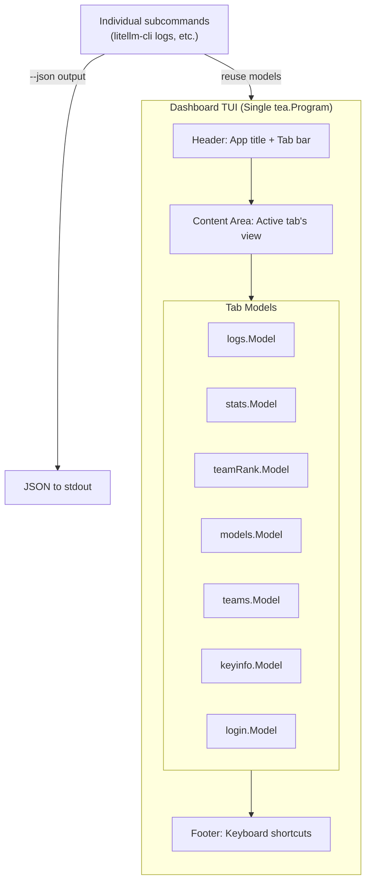

# Plan: Unified TUI Dashboard

## Summary

Create a unified dashboard TUI that combines all litellm-cli subcommands into a single tabbed interface. Users run `litellm-cli` without a subcommand to see a browser-style interface with tabs at the top. Arrow keys (←/→) switch between views. Default tab is "logs". Existing subcommands remain functional for backward compatibility and support `--json` output for non-interactive use.

## Problem Frame

Currently each subcommand (`litellm-cli logs`, `litellm-cli stats`, `litellm-cli team_rank`) launches an independent TUI experience. Users must exit one view to launch another, with no shared state or navigation between views. The experience feels like "a collection of CLI tools" rather than "an integrated application".

This plan addresses:
- R-1: Unified entry point (`litellm-cli` launches dashboard)
- R-2: Tab navigation with arrow keys
- R-3: All 7 subcommands as tabs
- R-4: Independent tab state preservation
- R-5: Backward compatibility
- R-6: Non-interactive `--json` mode
- R-7: Single Bubble Tea Program architecture
- R-8: Consistent visual design

## Requirements Traceability

| Requirement | Description | Implementation Units |
|-------------|-------------|---------------------|
| R-1 | Unified entry point, default tab "logs" | U1, U8 |
| R-2 | Arrow keys switch tabs, visual highlight | U2 |
| R-3 | All 7 subcommands as tabs | U3, U4, U5, U6 |
| R-4 | Each tab maintains scroll, filters, state | U2, U3, U4, U5, U6 |
| R-5 | Existing subcommands remain functional | U7, U8 |
| R-6 | `--json` flag for non-interactive mode | U7 |
| R-7 | Single Bubble Tea Program architecture | U1, U2 |
| R-8 | Consistent color scheme and styling | U2 |

## High-Level Technical Design



**Architecture Pattern:**
- `dashboard.Model` contains all 7 tab models as embedded structs
- `View()` method switches content based on `activeTab`
- Tab state is preserved by keeping each model alive in the parent
- Shared header/footer rendering via `internal/tui/components`

## Key Technical Decisions

| Decision | Choice | Rationale |
|----------|--------|-----------|
| Tab order | logs, stats, team_rank, models, teams, keyinfo, login | Requirement R-2; logs as default (most frequently used) |
| Tab state storage | Each model stored as embedded struct in parent | Preserves state across tab switches without serialization |
| Team rank TUI | Full TUI (not status panel) | Matches existing stats/logs pattern for consistency |
| --json implementation | Each subcommand checks flag before launching TUI | Simple, no refactoring of existing TUI code needed |
| View switching | Single Model with `activeTab` field | Minimal code changes to existing models |
| Quit key handling | Dashboard intercepts 'q'/'ctrl+c' before child models | Child models' internal quit handling would only quit that tab's state, not the entire dashboard |
| Window size propagation | Forward tea.WindowSizeMsg to active child model | Child models need actual dimensions for correct rendering |
| TeamRank client | Define TeamRankClient interface in teamrank package | Follows pattern from logs.LogsClient and stats.StatsClient |
| Message dispatch | Use type switches with package-qualified message types | Prevents collision between custom message types (LogsLoadedMsg, StatsLoadedMsg) |

## Implementation Units

### U1. Create Dashboard Model and Base Program

**Goal:** Create the unified dashboard model that orchestrates all tabs as a single Bubble Tea program.

**Requirements:** R-1, R-7  
**Dependencies:** None (foundation work)

**Files:**
- `internal/tui/dashboard/model.go` (new)
- `internal/tui/dashboard/view.go` (new)

**Approach:**
- Define `dashboard.Model` struct containing:
  - `activeTab string` - current active tab name
  - `logs *logs.Model`, `stats *stats.Model`, `teamRank *teamRank.Model`, etc.
  - `width int`, `height int` - window dimensions
- Implement `tea.Model` interface (Init, Update, View)
- View() delegates to active tab's View(), wrapped with shared header/footer

**Critical implementation details:**
- **Quit handling:** Dashboard must intercept 'q' and 'ctrl+c' BEFORE forwarding messages to child models. Child models handle quit internally, which would only quit that tab's state. Use a custom `DashboardQuitMsg` message type that dashboard handles directly to quit the entire program.
- **Window size propagation:** In dashboard.Update(), case tea.WindowSizeMsg must: (1) update dashboard's own width/height, AND (2) forward the message to the active child's Update method. Without this, child models will use default dimensions (logs: 120x40, stats: 120x40) and render incorrectly.
- **Init commands:** Dashboard.Init() should call the active tab's Init() and return those commands. Non-default tabs can use lazy initialization when first activated.

**Patterns to follow:**
- `internal/tui/stats/model.go` - tea.Model implementation pattern
- `internal/tui/logs/model.go` - message handling and state management

**Test scenarios:**
- Dashboard initializes with logs tab active by default
- Window size changes propagate to child models
- Quit signal (q/ctrl+c) exits cleanly from any tab

---

### U2. Implement Tab Navigation and Shared UI Components

**Goal:** Add tab bar, keyboard navigation, and consistent header/footer to the dashboard.

**Requirements:** R-2, R-8  
**Dependencies:** U1

**Files:**
- `internal/tui/dashboard/tabs.go` (new)
- `internal/tui/components/tabbar.go` (new)

**Approach:**
- Create tabbar component with visual distinction (active vs inactive tabs)
- Map arrow keys (←/→) to tab switching in Update()
- Render header with app title, tab bar, and optional status
- Render footer with keyboard shortcuts hint: "←/→: switch tab, q: quit"

**Technical design:**
```go
const TabOrder = []string{"logs", "stats", "team_rank", "models", "teams", "keyinfo", "login"}

func (m *Model) handleTabKey(msg tea.KeyMsg) {
    switch msg.String() {
    case "right", "l":
        m.activeTab = TabOrder[nextIndex(m.activeTab, 1)]
    case "left", "h":
        m.activeTab = TabOrder[nextIndex(m.activeTab, -1)]
    }
}
```

**Test scenarios:**
- Arrow keys cycle through all 7 tabs in order
- Active tab is visually highlighted in the tab bar
- Footer shows correct shortcuts based on active tab
- Tab state is preserved when switching away and back

---

### U3. Integrate Logs TUI as Dashboard Tab

**Goal:** Embed the existing logs.Model as a tab in the dashboard.

**Requirements:** R-3, R-4  
**Dependencies:** U1, U2

**Files:**
- `internal/tui/dashboard/model.go` (modify - embed logs.Model)

**Approach:**
- Embed `*logs.Model` in `dashboard.Model`
- Pass dashboard's client to logs model at initialization
- Handle logs-specific messages in dashboard's Update() and forward to logs model
- Logs model handles its own key events (j/k for scroll, enter for detail, etc.)

**Patterns to follow:**
- Existing logs model already implements tea.Model
- Forward tea.WindowSizeMsg to update dimensions

**Test scenarios:**
- Logs tab displays and polls data correctly within dashboard
- Arrow key (→) from logs moves to stats tab
- Tab switching preserves logs scroll position and filters
- q key exits the entire dashboard (not just the logs tab)

---

### U4. Integrate Stats TUI as Dashboard Tab

**Goal:** Embed the existing stats.Model as a tab in the dashboard.

**Requirements:** R-3, R-4  
**Dependencies:** U1, U2

**Files:**
- `internal/tui/dashboard/model.go` (modify)

**Approach:**
- Embed `*stats.Model` in `dashboard.Model`
- Forward stats-specific messages (tab, j/k navigation)
- Stats model maintains its own state (viewMode, selectedBarIndex)

**Test scenarios:**
- Stats tab loads and displays data correctly
- Tab key toggles stats between counter and bar view
- Stats state is preserved when switching tabs

---

### U5. Create Team Rank TUI Model

**Goal:** Create a new TUI for team_rank that matches the pattern of stats/logs.

**Requirements:** R-3  
**Dependencies:** U1, U2

**Files:**
- `internal/tui/teamrank/model.go` (new)
- `internal/tui/teamrank/model_test.go` (new)

**Approach:**
- Create teamrank.Model following stats.Model pattern
- Display team leaderboard with user rankings
- Show user's own rank highlighted
- Key handling: j/k to scroll, q to quit (passed to parent)

**Patterns to follow:**
- `cmd/team_rank.go` - existing team data fetching logic
- `internal/tui/stats/model.go` - TUI structure and rendering

**Test scenarios:**
- Team leaderboard displays sorted by spend descending
- Current user is highlighted with different color
- Keyboard navigation scrolls through the list
- Empty state shows "No team data"

---

### U6. Create Status Panel Models (models, teams, keyinfo, login)

**Goal:** Create simple status panel tabs for models, teams, keyinfo, and login.

**Requirements:** R-3  
**Dependencies:** U1, U2

**Files:**
- `internal/tui/dashboard/panels.go` (new - shared panel helpers)
- `internal/tui/dashboard/models_tab.go` (new)
- `internal/tui/dashboard/teams_tab.go` (new)
- `internal/tui/dashboard/keyinfo_tab.go` (new)
- `internal/tui/dashboard/login_tab.go` (new)

**Approach:**
- These tabs are read-only status displays (not full TUIs)
- Fetch data on tab activation if not already loaded
- Display in simple list/card format
- Can use existing command implementations for data fetching

**Test scenarios:**
- Each panel displays relevant information
- Data loads asynchronously with loading state
- Tab switching preserves loaded data
- Auth-required tabs show appropriate message when not logged in

---

### U7. Add --json Flag to Subcommands

**Goal:** Add `--json` flag to all subcommands for non-interactive/script usage.

**Requirements:** R-6  
**Dependencies:** None (standalone)

**Files:**
- `cmd/logs.go` (modify)
- `cmd/stats.go` (modify)
- `cmd/team_rank.go` (modify)
- `cmd/models.go` (modify)
- `cmd/teams.go` (modify)
- `cmd/keyinfo.go` (modify)

**Approach:**
- Add `--json` flag to each subcommand
- When `--json` is set, skip TUI initialization
- Call the same API client methods
- Marshal response to JSON and print to stdout
- Exit immediately after output

**Technical design:**
```go
var jsonOutput bool

func init() {
    logsCmd.Flags().BoolVar(&jsonOutput, "json", false, "Output as JSON")
}

func runLogs(cmd *cobra.Command, args []string) {
    if jsonOutput {
        // Fetch and marshal JSON, then exit
        data, _ := client.GetSpendLogsUI(...)
        jsonBytes, _ := json.MarshalIndent(data, "", "  ")
        fmt.Println(string(jsonBytes))
        return
    }
    // Existing TUI launch code
}
```

**Test scenarios:**
- `litellm-cli logs --json` outputs valid JSON to stdout
- `litellm-cli stats --json` outputs valid JSON
- `litellm-cli models --json` outputs model list as JSON
- All JSON outputs are properly formatted and parsable

---

### U8. Wire Root Command to Launch Dashboard

**Goal:** Configure `litellm-cli` (no subcommand) to launch the unified dashboard.

**Requirements:** R-1, R-5  
**Dependencies:** U1, U2, U3, U4, U5, U6

**Files:**
- `cmd/root.go` (modify)

**Approach:**
- Add a no-argument handler to root command
- When no subcommand is provided, launch dashboard TUI
- Individual subcommands continue to work as before
- Root command shows dashboard as default experience

**Test scenarios:**
- Running `litellm-cli` with no args launches dashboard
- Default tab is "logs" on launch
- Running `litellm-cli logs` launches logs TUI directly
- Running `litellm-cli logs --json` outputs JSON

---

## Scope Boundaries

### Inside This Plan
- Unified dashboard with tabbed navigation
- All 7 subcommands accessible as tabs
- Backward compatibility for existing subcommands
- --json flag for non-interactive mode

### Deferred for Later
- Drag-and-drop tab reordering
- Tab persistence across sessions
- Custom themes/user color schemes
- Tab configuration (order, hidden tabs)

### Outside This Product's Identity
- Multiple dashboard windows
- Cross-instance dashboard sharing
- Cloud sync of dashboard state

## Risks & Dependencies

| Risk | Impact | Mitigation |
|------|--------|------------|
| Existing models not designed for embedding | Medium | Models already implement tea.Model; forward messages via parent Update() |
| Team rank needs new TUI development | Low | Can reuse patterns from stats model |
| State management complexity | Medium | Each child model maintains its own state; parent only tracks activeTab |
| --json testing requires mock data | Low | Can use existing test utilities |
| Quit key handling in child models conflicts with dashboard | **High** | Dashboard's Update must intercept 'q'/'ctrl+c' BEFORE forwarding to child models. Use a custom message type (DashboardQuitMsg) that the dashboard handles directly. |
| Window size not propagated to child models | **High** | In dashboard.Update(), case tea.WindowSizeMsg must update dashboard dimensions AND forward the message to the active child's Update method. |
| TeamRank model lacks client interface | **Medium** | Define a TeamRankClient interface in teamrank package, or reuse existing API calls from cmd/team_rank.go |
| Status panel tabs lack implementation pattern | Low | Create a simple PanelModel interface or generic component that accepts a data fetcher function |

## Verification

1. **Manual verification checklist:**
   - [ ] `litellm-cli` launches dashboard with logs tab
   - [ ] Arrow keys switch between all 7 tabs
   - [ ] Each tab renders correct content
   - [ ] Tab state preserved after switching away and back
   - [ ] `litellm-cli logs` still works independently
   - [ ] `litellm-cli logs --json` outputs valid JSON

2. **Automated test expectations:**
   - All new packages have corresponding `_test.go` files
   - Tab navigation has unit test coverage
   - Dashboard model handles window resize events
   - --json flags are tested for all subcommands